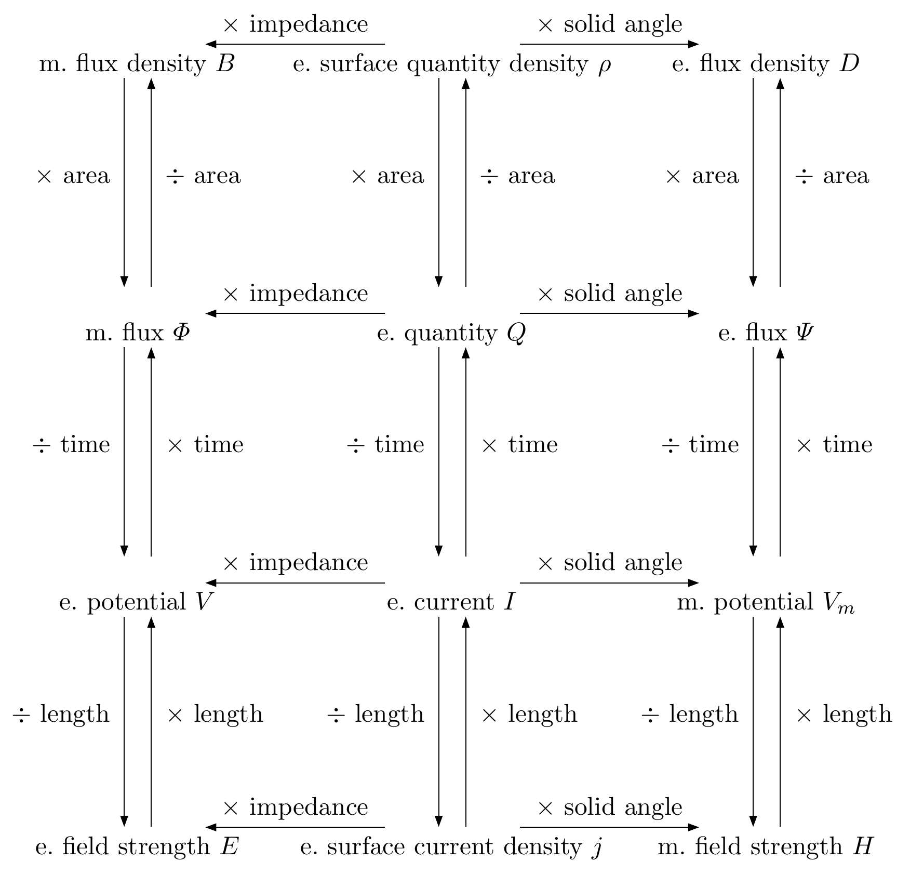
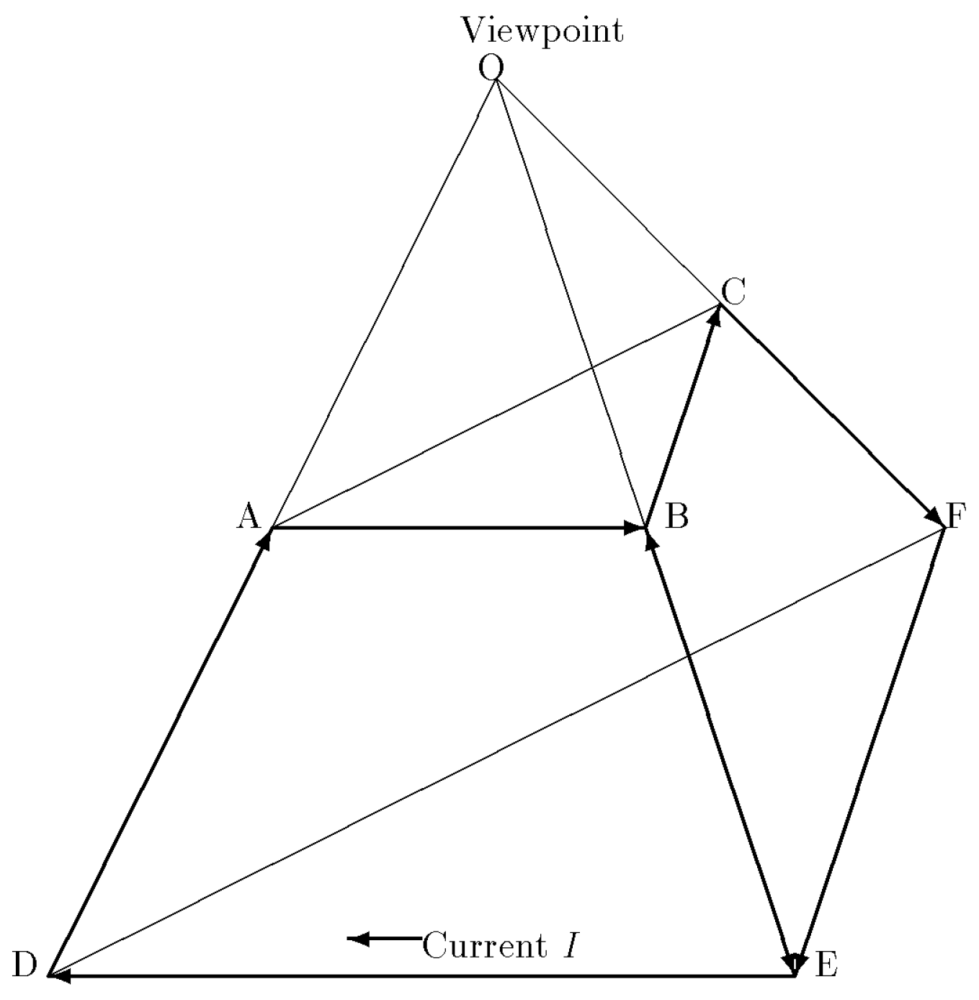

# 量が固有の次元を持つべき条件

## 設計基準としての自然単位の一意性

須賀 隆 (Takashi Suga) — 独立研究者、日本
E-mail: suchowan@box.email.ne.jp
2026年10月2日

> 本稿は英語版 *When Should a Quantity Have Its Own Dimension? — Uniqueness of
> Natural Units as a Design Criterion* (v1.0.3) の日本語版である。相違がある場合は
> 英語版を正本とする。→ [manuscript.pdf](manuscript.pdf)

---

## 目次

- [要旨](#要旨)
- [1. 序論](#1-序論)
- [2. 基準——自然単位の一意性](#2-基準自然単位の一意性)
  - [2.1 単位を単位たらしめるもの](#21-単位を単位たらしめるもの)
  - [2.2 焦点としての自然単位](#22-焦点としての自然単位)
  - [2.3 基準](#23-基準)
- [3. 一意性の事例——物質量](#3-一意性の事例物質量)
- [4. 非一意性の事例——角度、そして対数](#4-非一意性の事例角度そして対数)
  - [4.1 二つの候補、二つの構造](#41-二つの候補二つの構造)
  - [4.2 非一意性は推測ではなく記録である](#42-非一意性は推測ではなく記録である)
  - [4.3 最も強い反論——ラジアンは本当は一意ではないのか](#43-最も強い反論ラジアンは本当は一意ではないのか)
  - [4.4 立体角も同じ試験に失敗する](#44-立体角も同じ試験に失敗する)
  - [4.5 第三の試験例——対数量](#45-第三の試験例対数量)
- [5. 有次元の角度とともに生きる——橋渡し定数](#5-有次元の角度とともに生きる橋渡し定数)
  - [5.1 設計課題](#51-設計課題)
  - [5.2 角度あたりの定数は旧知の友であって変則ではない](#52-角度あたりの定数は旧知の友であって変則ではない)
  - [5.3 算術が閉じることの実証](#53-算術が閉じることの実証)
  - [5.4 次元が増えれば解析は強くなる](#54-次元が増えれば解析は強くなる)
- [6. 帰結——付加された次元が何をもたらすか](#6-帰結付加された次元が何をもたらすか)
  - [6.1 Ω₁ の有次元化——暦時間と物理時間の分離](#61-ω-の有次元化暦時間と物理時間の分離)
  - [6.2 Ω₂ の有次元化——電磁気量の対称な配置](#62-ω-の有次元化電磁気量の対称な配置)
  - [6.3 共通の型](#63-共通の型)
- [7. 構造としての基準——UUS/ハーモニック・システム](#7-構造としての基準uusハーモニックシステム)
- [8. 結論](#8-結論)
- [謝辞](#謝辞)
- [参照文献](#参照文献)

---

## 要旨

SI における平面角の次元的地位をめぐる長年の論争は、角度に固有の問題として、有次元か無次元かという二者択一の形で論じられてきた。本稿は、その論争に欠けていた一般的な基準を提案する。すなわち、ある量の種類が情報を失うことなく純粋な数で表現できるのは、その種類が*一意な*自然単位——事前の意思疎通なしに独立した当事者が収斂するであろう焦点——を持つ場合、かつその場合に限る。同程度に自然な候補が二つ以上存在するならば、その種類は独立した次元を担うべきであり、選から漏れた候補は単位系の有次元定数となる。この基準は、物質量(一意な自然単位 *N*A⁻¹ を持つ。モルは正当だが任意である)と、平面角および立体角(それぞれ通約不可能な二候補——rad と Ω₁ = 2π rad、sr と Ω₂ = 4π sr——を持ち、独立した次元を要する)とを単一の枠組みの中で裁定し、文献に記録されたヘルツとラジアン毎秒とのあいだの非コヒレンスと、電磁気学における一世紀にわたる有理化論争とを、一意でない種類を無次元化したことから予測される故障モードとして同定する。対数量は log e, log 2, log 10 という三つの候補を持ち、物理をまったく含まない第三の試験例を提供する。本稿は SI への変更をいっさい提案しない。そのかわりに、反対の設計選択を採った完全な実装済み単位系である普遍単位系(UUS)/ハーモニック・システムを、存在証明として検討する。そこでは [X/角度] の次元を持つ量が、首尾一貫した、歴史的に馴染み深い橋渡し定数の範疇をなし(海里も原メートルもこの形である)、付加された次元は次元解析を強化して、暦時間を物理時間から分離し、五つの基本次元の上での電磁気量の対称な配置——1997 年にそこで確立されたもの——をもたらす。その配置において、場の強さの比と電気抵抗とは異なる次元を獲得し、ひとつの係数 1/2Ω₂ が電磁場のエネルギー密度とアインシュタイン方程式の双方に現れて、慣用形の 8π がひとつの有次元定数であったことを明かす。次元 s⁻¹ 自体も三つに分解する。周波数の [角度/時間]、放射能の [物質量/時間]、速度定数の [対数量/時間] である。この比較は SI を補完するものとして提示される。いずれの単位系も選択を行っている。並べて置くことで、その選択が選択として見えるようになる。

---

## 1. 序論

国際単位系(SI)における平面角の地位は、SI が存在する限りずっと未決着のままである。ラジアンとステラジアンは、1960 年に当初、それら独自の範疇——*補助単位*——に置かれた。CIPM 勧告 U1(1980)は補助単位を無次元と解釈し、1995 年にはこの範疇そのものが廃止されて、ラジアンとステラジアンは無次元の組立単位に再分類された。現行の SI 文書はこれに従って平面角を二つの長さの比として扱い、1 rad = 1 m/m = 1 としている [1]。

この決着は普遍的な同意を得たことがなく、この十年、論争は *Metrologia* 誌その他の誌面で激しさを増してきた。Mohr と Phillips は、無次元単位——角度と計数単位とを問わず——に対する SI の扱いが非コヒレンスを導入しており、それはヘルツの曖昧な地位に例示されると論じた [2]。Mills はラジアンとサイクルの関係を検討した [3]。続いて Quincey、Mohr、Phillips は、角度は本来的に長さの比でも無次元でもないと論じ [4]、Kalinin は平面角と立体角の双方に独立した次元を与えることを提案した [5]。さらに Quincey は、ラジアンを独立した単位として扱い、値 1 rad を持つ有次元の角度定数 *θ*N を物理方程式に復活させることで整合性を確保する、詳細な提案を提出した [6]。この提案は批判的なコメント [7, 8] とさらなる精緻化 [9] を呼び、寄稿はなお現れ続けている [10]。この論争は歴史上の好事ではない。現代計量学における、活発かつ未解決の問いである。

しかし制度のうえでは、この問いは凍結している。2016 年に単位諮問委員会(CCU)委員長が長さ諮問委員会(CCL)に諮ったとき、報告された CCL の総意は、ラジアンを SI の基本単位とすることへの支持はない、というものであった [8]。したがって公式の立場——平面角は無次元である——は据え置かれており、近い将来にこれが改められる現実的な見込みはない。

ここで注意を促したいのは、角度だけを枠組みとして論じられてきたために、論争がおおむね暗黙のままにしてきた問いである。すなわち、*そもそもいかなる一般的基準によって、ある量の種類に独立した次元を割り当てるべきなのか*。この問いは角度より広い。SI の無次元の範疇は角度だけでなく計数量をも覆っており [2]、物質量——計数量を大きく引き伸ばしたもの——は正反対の極に位置する。物質量は自らの基本単位モルを*持って*いるにもかかわらず、計数には単位など要らないという理由で、その単位としての地位が繰り返し疑問に付されてきた。言い換えれば SI は、無次元化しても無害であろう量には次元を与え、無次元化が争われている量には次元を与えていない。両方の場合を単一の枠組みの中で裁定する基準こそ、この論争に欠けているものであるように思われる。

本稿はそのような基準——問題となっている量の種類の*自然単位の一意性*——を提案し、その帰結を検討する。冒頭で強調しておきたいのは、本稿が**提案しない**ことである。SI へのいかなる変更も提案しない。本稿の方法は比較である。普遍単位系(UUS)/ハーモニック・システム [11, 12] は、まさにこの点について SI と反対の設計選択を行った、完全で実装済みの単位系である。平面角と立体角を独立した次元として扱うのである。二つの単位系を並べて置くことで、それぞれの単位系が暗黙のうちに行っている選択が、*選択として*見えるようになる。この比較は競合ではなく相補性の精神で提示される。狙いは双方の単位系のより深い理解であって、いずれかを置き換えることではない。またこの問いは物理量に限られない。基準は量の種類の比構造のみに依拠しており、その最も透明な適用先は純粋に数学的な種類——底を取らない対数(4.5 節)——である。

本稿の寄与は次のとおりである。(i) ある量の種類がいつ独立した次元を保つべきかについての一般的基準(2 節)。(ii) その基準の、一意性の事例としての物質量への適用(3 節)、非一意性の事例としての平面角と立体角への適用(4 節)、および物理がまったく関与しない第三の非一意性の事例としての対数量への適用(4.5 節)。(iii) 基準を採用した単位系が、半径型の量と次元解析に関するよく知られた実務上の反論をいかに解消するかの説明(5 節)。(iv) その選択が何をもたらすかの提示——当の単位系のうちで既に確立されている結果、すなわち暦時間の物理時間からの次元的分離と、電磁気量の対称な次元的配置に基づく(6 節)。(v) 存在証明としての UUS/ハーモニック・システム(7 節)。

---

## 2. 基準——自然単位の一意性

### 2.1 単位を単位たらしめるもの

測定単位は標準的に、表現しようとする量と同じ種類[^kind]の量であって、その種類の量を比較する基準として約束によって選ばれたもの、と定義される [1, 13]。この定義には二つの要素があり、どちらも欠かせない。単位とは (a) *量*——自然に属するもの——であり、かつ (b) *約束*——合意する共同体に属するもの——である。したがって単位は、それ自体で自立する自然の対象ではない。量と、それを基準として用いることに合意する当事者とによって、共同で構成される。メートルは単に一つの長さではない。長さ*プラス*合意である。

[^kind]: 以下、「種類」は VIM [13, 1.2] の意味での量の種類の略である。

たいていの量の種類では、この二者構造は目につきやすい。数ある長さのなかからメートルを、数ある継続時間のなかから秒を選び出すものは自然のうちに何もなく、まさにその合意を維持するために大がかりな制度が存在している。興味深いのは、自然が共同体の仕事を代行しているように見える場合である。

### 2.2 焦点としての自然単位

ある量の種類のうちに、きわめて際立っていて、事前の意思疎通がまったくなくとも、独立した主体がそれぞれ基準として選ぶと期待できるような量が存在するとしよう。そのような量は、ゲーム理論が協調問題の*焦点*(フォーカルポイント)と呼ぶものとして機能する [14]。候補がすべての当事者にとって際立っている(salient)がゆえに、交渉なしに合意が成立するのである。このような量を、その種類の*自然単位*と呼ぶ。

ある量の種類が自然単位を持つとき、その種類のどの量も自然単位との比は純粋な数となり、その数を伝達しても情報は失われない。受け取った側は、同じ、一意に際立った基準を補うことで量を復元するからである。計数がその典型である。黒木が広く流布した指摘で述べたように、「長さは 5 mm だ」から単位を削ると情報は失われるが、「個数は 5 個だ」から助数詞を削っても何も失われない [15]。本稿の語彙で言えば、*要素の個数*という種類は自然単位——単一の要素——を持ち、それは一意である。物質量はこの構造を受け継いでおり、要素の計数がアボガドロ数によって固定されている。3 節で立ち返る。

ひとつ注意が必要であり、それは以下で実際に働く。ある量が「きわめて際立っている」という判断は、*主体によって*下される判断である。際立ちは協調する当事者に相対的である。[^salience] したがって 2.1 節の二者構造は自然単位によって消去されるのではない。黙って満たされているにすぎない。この観察は、一見すると欠陥(主観性)に見えるものを、操作的な試験へと転換する。すなわち、意思疎通なしに協調が成功するかどうかは、際立った候補が*一意である*かどうかによって決まる。同程度に際立った候補が二つ以上存在すれば、焦点は形成されない。当事者は結局のところ意思疎通せざるをえず、候補のあいだの選択はふたたび明示的な約束となる。

[^salience]: 2.2 節における際立ちの定義の形に注意されたい。際立ちは候補の何らかの内在的性質によってではなく、それが協調する当事者のあいだに引き起こす振る舞いのパターンによって特徴づけられる。これこそが、この試験を操作的なものにし、その失敗を観察可能にしている。

### 2.3 基準

ここで基準を述べることができる。

> **(C1)** ある量の種類が**一意な**自然単位を持つならば、その値は情報を失うことなく純粋な数として表現できる。その種類に独立した次元を割り当てることは任意である——必要性の問題ではなく、便宜の問題である。
>
> **(C2)** ある量の種類が同程度に自然な候補単位を**二つ以上**持つならば、純粋な数による表現は曖昧である。数だけでは量が定まらない。どの候補が基準として用いられたかが符号化されていないからである。そのような種類には**独立した次元**を割り当てるべきであり、そのとき候補単位は単位系の有次元定数となって、かつては明示されない約束が担っていた情報を、次元が明示的に担うことになる。

単位とは**ラベル**であり、ラベルが要るのは、区別しなければならないものがあるときだけである。単位は、複数の候補基準のうちどれが選び出されたのかを標示する——そして選べるものが一つしかなかったところには、標示すべきものが何もない。基準が量の性質にではなく**一意性**にかかっているのは、このためである。

基準を適用する前に、ひとつ明確にしておきたい。これまでの論争が主として基本単位の語彙で行われてきたためである。(C2) が規定するのは独立した次元であって、基本単位ではない。ある種類が純粋な数に還元されてはならないということは、その次元が当該の単位系において基本的であるか、それとも他の種類の次元から導出されるかについては何も言わない。両者のあいだの選択は、単位系の内部の実装上の決定である。立体角がその例を与える(4.4 節)。立体角は (C2) を満たすが、その次元は導出されたもの——平面角の次元の二乗——であって、新たな基本単位を伴わない。したがって本稿が提起する問いは、CCL が変更への合意なしと報告した問い [8]——ラジアンを SI の基本単位とすべきか——ではなく、それに先立つ問い、すなわち角度の純粋な数による表現が情報を失うかどうか、である。

この区別を置いたうえで、基準は既存の論争を組み替える。「平面角は有次元か無次元か」という問いは、その種類の構造についての事実の問いとなる。すなわち、*平面角は一意な自然単位を持つか*。本稿は、持たないと論じる(4 節)。ラジアンと全円周角 Ω₁ とはどちらもきわめて際立っており、その根拠は異なるが優劣をつけがたい。そして立体角も同じ仕方で一意性に失敗する。対照的に物質量は試験を通過する(3 節)。第三の種類——底を取らない対数——は三重に失敗し、その論証のどこにも物理は現れない。4.5 節がこれを取り上げ、あわせて、基準が比構造のみに関与することを示す。注目すべきことに、角度が「二つの自然単位」を持つという観察は、すでに論争のなかに現れている。Mills はラジアンとサイクルを選択肢として論じる論文を一篇充てており [3]、Quincey は、数学者と理論物理学者にとって角度の自然単位はラジアンだが、それ以外のすべての人にとっては一回転(revolution)である、と述べた [16]。そうした文献において、この観察は困難の記述として現れる。本稿の提案は、これを*基準*へと格上げすることである。自然単位の非一意性は、回避すべき不都合ではなく、独立した次元が必要であることのまさにその信号なのである。

角度について (C2) を採用することの帰結は二つあり、本稿の残りで展開される。第一に、有次元の角度に対して伝統的に提起されてきた実務上の反論——半径型の長さが m/rad という単位を獲得すること、馴染みの公式において次元解析が破綻するように見えること——は、(C2) を軸に設計された単位系においては、変則でも犠牲でもないことが判明する。「角度あたり」の量は、橋渡し定数という一般的かつ意図的に制度化された範疇をなすのである(5 節)。第二に、付加された次元は次元解析の分解能を低下させるのではなく高め、SI が同一視せざるをえない量の対を分離する(6 節)。

---

## 3. 一意性の事例——物質量

物質量は SI の基本量であり、2019 年の改定以降、その単位モルはアボガドロ数を固定することによって定義される[^avogadro]。1 モルはちょうど 6.022 140 76 × 10²³ 個の要素粒子を含む [1]。この量の種類は、まさにこの定義によって、指定された要素の*計数*に比例する。

2.2 節の試験を適用しよう。この種類は自然単位を——独立した当事者が意思疎通なしに収斂するほど際立った候補基準を——持つだろうか。持つ。*単一の要素*である。物質量を数として表現しようとする者は誰であれ、何らかの基準量で割らなければならない。そして一個の要素に対応する量——*N*A⁻¹——は、計数という構造そのものによって際立っている。それは分割不可能な刻みであり、この種類の生成元である。しかも真剣な対抗馬を持たない。他に考えうるあらゆる基準——対、ダース、グロス、あるいはモルそのもの——は要素の整数倍であり、際立ちを持つとすればそれを要素*から*得ている。対抗候補は存在するが、それらは派生的であって独立ではない。焦点は一意である。

したがって基準は (C1) を返す。物質量の値は情報を失うことなく純粋な数として表現できる。これはまさに 2.2 節で引いた黒木の観察の内容であり——「個数は 5 だ」は「個数は 5 個だ」が含むものを何も失わない [15]——、モルの単位としての地位に対する長年の懐疑が、ある精密な意味において正しい理由でもある。モルはメートルが*必要*であるようには必要でない。しかし (C1) は両刃であり、この点は強調されるべきである。(C1) が言うのは、独立した次元が*任意である*ということであって、それが誤りだということではない。物質量に基本単位を与えるという SI の決定は、この選択権の正当な行使であり、実務上の便宜を根拠としている。化学はマクロなスケールで営まれており、ヨクトグラムではなくグラムに見合った大きさの単位は、日々その存在価値を示している。(C1) が排除するのは、その次元が強制されているという主張だけである。この分析によれば、「単位」と単なる「助数詞」(日本語その他の類別詞言語における助数詞 [17])とのあいだには、明確な境界はなく、約束の明示性のグラデーションがあるにすぎない [18]。モルはそのグラデーション上に、必然によってではなく選択によって位置している。

この点において、2019 年のモルの再定義はこの分析の味方である。*N*A を測定される定数から厳密に固定された定義定数へと転じ、それとともに定義の向きを逆転させた——モルはいまや *N*A から定義されるのであって、*N*A がマクロなモルに対して測定されるのではない——ことによって、SI 自身が、この次元の錨をマクロな人工物の約束(炭素 12 の 0.012 kg)から単一の要素へと移したのである。一意な自然単位 *N*A⁻¹ を、その名では呼ばないにせよ、体系の基礎に据えたことになる。

ついでに記しておくと、SI における計数量の扱いそのものが、Mohr と Phillips によって非コヒレンスの源として同定されており、彼らは計数単位を角度の単位と並べて論じている [2]。彼ら自身の処方は、ここに記録しておくに値する。本節の評決に別の方向から到達しているからである。彼らは要素に対して記号 *ent* を提案し、モルをその倍量として 1 mol = 6.02 × 10²³ ent と書く [2]——上で同定した焦点をまさにこの種類の単位として選出し、モルを独立した標準ではなく自然単位に名を与えた倍量として残しているのである。本稿の基準は、この二つの場合を線の反対側に位置づける。計数は一意性の試験を通過し、角度は——以下で論じるように——失敗する。

[^avogadro]: 厳密には、アボガドロ*数*(無次元)とアボガドロ*定数* *N*A(次元は [物質量]⁻¹)とは別物であり、2019 年以前は後者が測定量、2019 年以降は定義定数である。本稿では一貫して有次元の読みを採る——下記の 2019 年再定義についての註を参照。

## 4. 非一意性の事例——角度、そして対数

### 4.1 二つの候補、二つの構造

平面角については二つの候補基準が現れ、そのそれぞれがきわめて際立っている——ただし、この種類が関与する*異なる構造*のなかで際立っているのである。

第一の候補は**ラジアン**である。その際立ちは解析的である。ラジアンは、弧長の関係が数係数なしに *s* = *rθ* と書ける単位であり、d(sin *θ*)/d*θ* = cos *θ* となる単位であり、テイラー級数とオイラーの公式が飾りのない形をとる単位である。この種類の微分的・解析的構造のうちでは、ラジアンは多くの選択肢のひとつではない。*その*選択である。

第二の候補は**全円周角**であり、ここでは Ω₁ と書く——サイクル、すなわち一回転である(Ω₁ を「サイクル」と読むのは UUS の約束である [19])。その際立ちは位相的かつ周期的である。角度は物理的世界が自然な周期を課す量であり、Ω₁ がその周期である。回転数(winding number)は Ω₁ を単位として数えられる。回転の速さは単位時間あたりの回転数として述べられる。度——数千年にわたる実用的な角度測定の作業単位——は、ラジアンの分割ではなく Ω₁ の分割(1/360)として定義されている。ヘルツは、実際の用法においてはサイクル毎秒を意味する。この種類の周期的構造のうちでは、Ω₁ が*その*選択である。実際この点は、角度の有次元化を主張する者たち自身が認めている。Kalinin は、知られているあらゆる平面角の単位——度、ラジアン、グラード、回転——が、二次元幾何学の自然定数と彼が呼ぶ全回転 Φ の値を固定することによって定義されている、と観察している [10]。

この状況を 3 節の計数の場合から区別する特徴が二つある。第一に、いずれの候補も、ダースが要素から派生するような仕方で他方から派生してはいない。比 Ω₁/rad = 2π は無理数であり、したがっていずれの候補も他方の整数倍でも分割でも表記上の変種でもない。第二に、際立ちの根拠が通約不可能である。解析的構造も周期的構造も、角度とは何であるかを真に構成しており、一方が他方に優越すると宣する中立な立脚点は存在しない。焦点は一意たりえず、(C2) により平面角は独立した次元を担うべきである——そのとき作業単位の選択は、それが常に密かにそうであったもの、すなわち明示的な約束となり(UUS は上述の解析的理由からラジアンを選ぶ [11])、選から漏れた候補 Ω₁ は値 2π rad の非コヒレント[^coherent]な有次元定数となる。

[^coherent]: 「コヒレント」は本稿を通じて、選ばれた定義関係の族に相対的である。三角形の面積が *ah*/2 か *ah* かは約束であって論理ではなく、コヒレントな面積の単位はその関係が指定されて初めて定まる——6.2 節の有理化/非有理化の分岐は、同じ自由度の電磁気学における現れである [20, pp. 45–50; 19, App. A.3]。この相対性は外からの観察ではなく、定義に属している。VIM は量の体系を「量の集合と、それらの量を関係づける無矛盾な方程式の集合」と定義し、コヒレントな組立単位を、「与えられた量の体系と、選ばれた基本単位の集合に対して」1 以外の比例因子を持たないものと定義している [13, 1.3 および 1.12]。この観点からすれば、4.4 節の極限による構成は、平面角と立体角のあいだの定義関係を明示的に選び取る行為である。

### 4.2 非一意性は推測ではなく記録である

角度が二つの自然単位を持つという観察は、本稿のものではない(2.3 節)。Quincey は、なお無次元の扱いを擁護していた時期に、問題の核心には角度について二つの自然単位があるという事実が横たわっている——数学者と理論物理学者にとってはラジアン、それ以外のすべての人にとっては一回転——と書いた [16]。しかしそうした文献では、この観察は*困難の記述*として、すなわちこの分野が混乱している理由の説明として現れ、より慎重な言い回しによって、あるいは後の Quincey 自身の展開された立場においては有次元の角度定数を復活させることによって [6]、管理されるべきものとされている。ここで踏み出す一歩は、この観察を規範的に読むことである。自然単位の非一意性は、次元の問いを取り巻く不運な事情なのではない。それは次元の問いに*答えている*。通約不可能な二つの焦点を持つ種類は、損失なしに無次元化することができない。純粋な数は、どちらの焦点が用いられたかを記録しないからである。

そしてその損失は、仮想のものではなく記録されたものである。Mohr と Phillips が示した非コヒレンス——どちらの無次元単位が黙って数 1 に置き換えられたかに応じて、同一の物理的状況が 1 Hz とも 2π s⁻¹ とも記述され、その下流の帰結として 2π 倍の誤りが生じうること [2]——は、まさに (C2) が一意でない種類について予測する故障モードである。制度のうえでの SI 自身の角度の扱いの歴史もまた同様である。創設され(1960)、解釈し直され(1980)、廃止された(1995)範疇 [1, 5] は、一意で自明な基準を保有している共同体の記録ではない。一意な自然単位が現に存在するところ——計数——では、これに比すべき制度上の動揺は見出されない。Mohr と Phillips が計数の側に位置づける非コヒレンス [2] は、計数の内部の非一意性から生じているのではなく、計数と角度が同一の無次元単位に畳み込まれていることから生じている。曖昧さを担っているのは畳み込みであって、計数ではない。

### 4.3 最も強い反論——ラジアンは*本当は*一意ではないのか

無次元の角度を擁護する者は、二つの候補は同程度に自然ではないと反論するだろう。ラジアンの解析的特権は客観的な数学であるのに対し、サイクルの際立ちは単なる習慣であり人類学である、と。もしラジアンが*真の*焦点であるなら、一意性は結局成り立ち、(C1) が適用される。

この反論は周期的構造を過小評価している。サイクルの特権は習慣ではない。それは、角度が長さや継続時間と違って本来的に円の上の量であり、Ω₁ がその円の周長をこの種類自身の言葉で表したものである、という位相的な事実である。回転数——整数であり、数学において最も頑健な不変量のひとつ——は、ラジアンではなく Ω₁ の個数である。位相が物理的に意味を持つのは 1 rad を法としてではなく Ω₁ を法としてである。素朴な試験がこの点を具体的にする。人間の生活において最も古く最も普遍的な角度量は、日——地球の一回転——である。ラジアンこそ角度の唯一の真の自然単位だとする最も筋金入りの支持者でさえ、一日を 2π rad の角度として捉えようとは提案しないし、時間を回転のラジアンで数えようともしない。日は、誰にとっても、全回転の整数として数えられる(この事実は 6.1 節が体系的に活用する)。現象そのものが周期的であるところでは、解析の実践をラジアンの上に築いている者にとってさえサイクルが際立つ。そして、周期的構造のうちで競合相手自身の支持者から自発的な忠誠を得るような候補は、説明して片づけられる習慣ではない。実際、二つの候補の争いは純粋数学の内部で生きている。基本的な円周定数は π か τ = 2π かという繰り返される議論は、突き詰めれば、どちらの構造がその定数に名を与える権利を持つかをめぐる争いである。τ の側は周期から論じ(唯一の非恣意的な基準としての全回転)、π の側は π が飾りなしに現れる解析的恒等式の蓄積された重みから論じる(π*r*²、eiπ + 1 = 0、Γ(½) = √π)。双方がそれぞれの公式の砲列を並べうること、そしてこの議論が決着を見ないまま繰り返されることこそ、際立ちの根拠が通約不可能であるとはどういうことかの実地の姿である——しかも論争の当事者は、ラジアンの解析的特権が決定的であるはずのまさにその母集団なのである。

より根本的には、この反論は問いの所在を取り違えている。2.2 節で述べたとおり、際立ちは候補と協調する当事者とのあいだの関係であり、一意性の操作的試験は、意思疎通なしに協調が現に成功するかどうかである。この試験による評決は経験的であり、それは記録のうちにある。これらの量が測定されるようになって以来ずっと、二つの実践共同体が併存し、それぞれが異なる候補を自明としてきた——そして SI がラジアンとサイクルの双方を同じ数 1 に置き換えることを許したところで、協調は目に見えて失敗した [2]。焦点を論証によって一意にすることはできない。一意な焦点とは、*論証を不要にする*ものである。この論争そのものが持続していることが、その証拠である。

強調しておくが、この説明はラジアンへのいかなる批判も含意しない。ラジアンを*作業単位*として選ぶ解析的な根拠は優れており、UUS もそのように選んでいる(4.1 節)。基準が主張するのはただ、この選択が、前提としてよい発見ではなく、次元によって記録されなければならない約束である、ということだけである。

### 4.4 立体角も同じ試験に失敗する

立体角は、次元をひとつ上げたところで同じ構造を示す。解析的な候補はステラジアンであり、立体角を平面角の次元に帰するとき sr = rad² によってラジアンと関係づけられる。周期的な——より正確には*閉包*の——候補は全球面立体角 Ω₂ = 4π sr、すなわち内部の一点のまわりの閉曲面の立体角であり、積分定理(ガウス)と等方性によって際立っている。

ここでも非一意性は制度上の記録を残しており、しかもより長い記録である。電磁単位系が「有理化された」族と「有理化されていない」族とに一世紀にわたって分かれてきたことは、突き詰めれば、因子 4π——すなわち Ω₂——がどこに属するかをめぐる不一致であり、それぞれの族が立体角を異なる基準に黙って正規化しているのである [12]。なされなければならない選択であり、併存する主要な単位系によって異なる仕方でなされてきた選択であり、その黙った分岐が、電磁気学を学ぶ者が誰しも辟易するあの 4π の勘定そのものを生み出している選択——それは、名を除けばあらゆる意味で明示的な約束である。(C2) により、立体角は平面角と同じく一意性の試験に失敗し、評決も同じである。

この評決を尊重するのに*第二の*基本次元は必要ない。UUS において、超球面立体角は平面角の整数冪である。ステラジアンは rad² であり、k 次元超球の全立体角は Ω*k* = (2π(*k*+1)/2 / Γ((*k*+1)/2)) rad*k* で与えられ、Ω₁ = 2π rad、Ω₂ = 4π rad²、Ω₃ = 2π² rad³ などとなる [19]。この設計には明示するに値する長所がある。基準は平面角に対して*一度だけ*適用され、その後は付加された単一の次元が、あらゆる次元 k の球面幾何を賄う——超球へと上っていくときに角度の次元が際限なく増殖することはない [19]。立体角は平面角からその次元(rad²)を受け継ぎ、非一意性もまた受け継ぐ。対 (sr, Ω₂) は立体角に対して、対 (rad, Ω₁) が平面角に対して立つのとまったく同じように立ち、Ω₂ は値 4π rad² の有次元定数として体系に入る。その電磁気学上の帰結は 6.2 節で展開する。

厳密性についての注記が必要である。批判者は、そもそもどのような意味で二つの平面角を掛け合わせられるのかと問う権利があるからである。sr = rad² という同一視は、表記上の取り決めではない。球面上では、有限の図形がこの積を厳密に実現することはない。有限の辺 *θ* を持つ球面正方形の立体角は、曲率の項のぶんだけ *θ*² からずれる [19, eq. (18)]。そこで UUS はこの積を無限小による構成によって*定義*する——*θ*² とは、辺 *θ*/n の球面正方形の立体角の n² 倍の、n → ∞ における極限である [19, eq. (19)]。この定義のもとで曲率によるずれは消え、次元の算術は厳密になる。これは立体角に特有の瑕疵ではない。角度の次元の合成を、ラジアン自身の解析的特権(4.1 節)と同じ地盤に置くものであって、後者もまた、この種類の無限小における平坦な構造についての言明なのである。[^rectification] 次元解析が要求するのは、種類が乗法的に合成されることだけである。極限による構成は、その合成の幾何学的な実現を供給する。

[^rectification]: 弧長の求長も小角度の恒等式も、どちらも極限についての言明である。平面角は、円の対称性を介して、厳密な有限の関係 *s* = *rθ* をひとつ保持しているが、立体角にはこれに対応するものがない。

### 4.5 第三の試験例——対数量

基準は量の種類一般について定式化されたのであり、その非自明な適用先が二つの角度の種類だけであったなら、それは疑わしいことであろう。第三のものがあり、それが教えるところは大きい。まさに物理がまったく関与しないからである。

対数を考えよう——特定の底を持つ対数ではなく、関数方程式 log(*xy*) = log *x* + log *y* によって定義される対象である。この方程式は*構造*(乗法から加法への準同型)を定めるが、正規化は定めない。その連続解は一径数族 {c·ln} をなす。言い換えれば、この定義は量の種類を与えたところで止まり、そのなかの一員を選出するには至らない。著者はこの対象を*底なし対数*と呼び、UUS の最初の提案の付録において、それが純粋に数学的な存在でありながらなお数ではなく*量*であると論じた [19, App. A.2]。log 2 = 0.3010… log 10 は量のあいだの等式であって、同じ種類の選ばれた一員で両辺を割ることによってのみ数に還元される。

その除算は、馴染みの底の変換公式を新鮮な目で読んだものである。log *x* / log 2 = log₂ *x*。底を取ることは*まさに*単位を選ぶことであり、log₂ の添字は変装した単位の表記である。数値 log₂ *x* が量 log *x* に対して立つのは、数 5 が長さ 5 m に対して立つのとまったく同じである。同じ読みは角度の場合にも当てはまる。Kalinin は、有次元の平面角 *φ* と、物理の方程式に入る無次元の組み合わせ *θ* = *φ*/(*Φ*/2π) とを区別し、後者を、計量学がラジアンで表した角度の数値と呼ぶものと同定している [10]——まさに本稿の意味における、選出された単位で割られた量である。したがって、対数を無次元とみなす標準的な理由——「log₂ *x* はただの数だ」——は何も立証しない。有次元の量はいずれも、単位で割れば数を与えるからである。純粋に数学的な設定が付け加えるのは、適用範囲の証明である。2.1 節の二者構造も 2.2 節の一意性の試験も、種類の*比構造*のみに関与するのであって、物理的な装置による測定可能性には関与しない。(VIM の量の定義は現象・物体・物質の性質について語っている [13]。[19] でなされた数学的対象への拡張は意図的なものであり、ここでは無害である。基準の機構は比以上のものを何ひとつ用いないからである。)

有次元の量を引数にとる関数の定式化は、角度については独立に追求されてきた。Mohr らは、三角関数と指数関数を、単位に言及することなく角度の次元を担う引数を受け取れるように一般化している [9]。本節の対数への適用はこれと並行する事例であり、しかも物理量がまったく関与しない設定においてのことである。

さて、試験を適用しよう。対数という種類の自然単位の候補は少なくとも三つ現れ、それぞれが異なる構造のうちで際立っている。**log e**(ネーパ)は解析的に際立つ——d(log *x*)/d*x* = 1/*x* および log(1+ε) ≈ ε となる正規化である。**log 2**(ビット)は計数によって際立つ——最小の整数比の対数であり、倍化の単位である。**log 10**(ハートレー、ベル系)は位取り記数法によって際立つ——十進の桁数を数える。rad と Ω₁ の場合と同様、これらの候補は互いに派生的でない。log₂ 10 は素因数分解の一意性により無理数であり(2p = 10q はありえない)、したがって log 2 と log 10 はいずれも他方の整数倍でも分割でもない。また log e は整数対数の族全体から離れて立っている。e が超越数だからである。いずれも他に還元されない。焦点は一意たりえず——ここでは三重に——、(C2) は角度の場合と同じ評決を返す。

そして角度の場合と同様、この評決は歴史の記録によって反駁されるどころか裏づけられる。Shannon は情報理論の創始論文の冒頭で、対数の底の選択を情報の単位の選択と同定し、ビット、十進桁、自然単位を一息に挙げた [21]——本節が形式化するその同定が、この分野の誕生の場に居合わせていたのである。計量学の側はといえば、対数の単位を実務のうえで数 1 へと畳み込むことにこれまで一度も成功していない。ネーパ、ベル、デシベルは名を持つ単位として存続し、その定義と相互関係には一篇の論文を要した [22]。情報の単位は複数のものとして標準化されている(シャノン、ハートレー、自然情報単位)[23]——ひとつの種類に三つの単位が併存しているのは、そのあいだの選択がついぞ強制されなかったからである。ネーパとベルは、その定義式が因子 2 だけ異なることを根拠に、二つの異なる量の種類——前者は振幅比に、後者は電力型の比に——に属するとされることがある [24]。本稿の説明では、この因子は対数という種類そのものにではなく対数の引数に属する。変わるのはどの比を取っているかであって、どの種類の量が結果するかではない。UUS はこれに対応して、そうした表現を専用の演算子 ° を用いて書く。° は(°C や dBm に見られるように)尺度間隔と基点を組み合わせる演算子であり、これによって基準の選択が単位とともに記録される[11, App. A.1, item (8)]。そして 7 節で述べる体系において、UUS は評決そのものを実装している。対数の次元を持ち、ネーパを作業単位として選出し、選から漏れた候補を有次元定数 ℧*k* = log 2*k* として——そのなかにビットを含めて——収めているのである。

証拠としての形ゆえに記録に値する事実がもうひとつある。2026 年——[19] の二十四年後——に、同じ対象が独立に、しかも「baseless logarithm(底なし対数)」というまったく同じ名のもとに、Kritchevsky のエッセイ [25] において形式化された。そのエッセイは、底の変更は単位の変更であるという同じ描像を、一般の読者に向けて展開している。この収斂は、6.1(3) 節で述べる UUS の Ω₁ と SI 側の提案の *θ*N とのあいだの収斂と同じ構造を持つ。すなわち、異なる関心から出発し、互いを知らない二者が、同じ構成に到達するという構造である。基準は論証によって支持されうる。だが、繰り返し再発見される構成は、それ自体が自らを論証している。

---

## 5. 有次元の角度とともに生きる——橋渡し定数

### 5.1 設計課題

基準 (C2) は、単位系に対して角度に次元を与えよと告げる。しかし、そのあとの取り回しをどうするかまでは、それ自体では告げない。取り回しに関わる問いはよく知られており、2015 年に、自身の立場が変わる以前の Quincey によって精確に列挙され [16]、また Křen によって改めて突きつけられた。Křen は、有次元の角度は時間について異なる種類の量を導入し、その単位は秒毎ラジアンとして定義されることになる、と異議を唱える [8]。角度 *θ* が次元を担うならば、弧長の関係 *s* = *rθ* は *r* をただの長さとしたままでは成り立ちえない。角度を弧に変換する「半径」は m/rad という単位を担わねばならず、どうやら二種類の長さを区別しなければならないことになる——そして、その区別が扱いにくくなる場所として、ボーア半径、π*r*² のなかの *r*²、慣性モーメント、そして次元解析の日常的な実践(ストークス抗力の議論)が挙げられる。本稿は SI への変更を提案しないのだから、これらはわれわれにとって反駁すべき反論ではなく*設計課題*である。(C2) を採用する単位系はいずれも、[X/角度] の次元を持つ量がどう振る舞うかについての説明を負っており、その説明は公式ごとの継ぎ当てではなく体系的なものでなければならない。問いも新しくなければ、答えもまた新しくない。Eder は 1982 年に、平面角は有次元であるという明示的な仮説のもとでこれらを体系的に探究し、三角関数、回転体の体積、極限と級数展開への帰結を導き、SI のいくつもの組立単位の表現に対する改訂を提案している [26]。批判者が困難の一覧として提示するものは、Eder の手にかかれば、展開されるべき帰結の綱領なのである。本節は UUS が与える説明を述べる。そこではそうした量が、意図的に名を与えられた範疇をなしている。力学側の勘定(トルク、角運動量、慣性モーメント)は論争そのもののなかで現在進行中のやりとりの主題であり [6, 7, 9]、ここで蒸し返すことはしない。

### 5.2 角度あたりの定数は旧知の友であって変則ではない

中心となる観察は、[X 毎角度] の次元を持つ量が、角度の有次元化によって呼び出された珍奇な存在ではない、ということである。実務の計量学はつねにそれらを含んできた。無次元の角度という約束は、それらから目に見える単位を奪っているにすぎない。

海里を考えよう。海里は歴史的に「子午線に沿った緯度の一分」という言明によって定義された——すなわち、角度(一分角)と、長さ毎角度という次元を持つ変換定数、つまり張る角度あたりの子午線の長さとの積として定義されたのである。1929 年以降、国際海里はちょうど 1852 m に固定されているが [1]、これはその歴史的定義との一致を理由に選ばれた値である。固定が変えたのは定義であって、実務ではない。緯度差を航走距離に換算する航海者は、角度に m/rad という単位の橋渡し定数を掛けているのであり、何世紀ものあいだ、それを何ら気まずさなく行ってきた。メートルそれ自体の当初の定義——パリ子午線の四分の一の一千万分の一——も、同じ形の言明である。すなわち、子午線定数を介して角度(四分の一サイクル)から得られた長さ、である。

UUS はこの定数に名を与え、体系の定数へと格上げする。**メリディアン** *m*E、すなわち全円周角あたりの地球の子午線円の長さであり、次元は [長さ/平面角]、*m*E · rad ≈ 6.37 × 10⁶ m——数値としては地球の半径である [27]。この命名の要点が本節の要点である。角度が有次元である単位系において、「半径型の長さ」は我慢すべき欠陥ではなく、*名を持つ成員を擁する物理的に意味のある範疇*なのである。円の幾何学的半径は、中心角を弧へ変換するものとして、この範疇の量である。子午線定数はその惑星規模の代表例である。

しかもこの範疇は長さに限られない。UUS は第二の地球局所定数、**ソーラー** *s*E を定義する。全円周角あたりの地球の平均太陽自転周期であり、次元は [物理時間/平面角] である [27]。常用日——「平均太陽に対する地球の一回転」——が *s*E に対して立つのは、海里が *m*E に対して立つのとまったく同じである。橋渡し定数を介して継続時間として表された角度、である。(この場合の全面的な展開は 6.1 節の主題である。)この並行は厳密であり、勘定上の厄介事を構造へと転じるのはこの並行である。すなわち、*ひとつ*の範疇 [X/角度] があり、その成員は少なくとも長さ(*m*E、およびあらゆる曲率半径)にも時間(*s*E、およびサイクルあたりのあらゆる回転周期)にも存在し、いずれも周期的な変数を線形な変数へと変換する。批判者が二種類の長さとして提示するものは、量とその角度あたりの蓄積率との一般的な区別として記述する方が適切である——SI が記録せず、UUS が述べることのできる区別である。

実際、この二つの角度あたりの定数は、一様な職務記述を持つより広い一族の、角度に関わる成員である。この体系の地球局所の橋渡し定数は四つ組をなす——メリディアン *m*E(地球角度あたりの長さ)、ソーラー *s*E(暦角度あたりの物理時間)、ジー *g*E(質量あたりの地球重量)、そして基準温度 *T*E(熱力学温度に対する日常的な地球の温度)——いずれも局所的に際立つ量を普遍的な種類に関係づけている [11, Table 8]。批判者が長さの変則として提示するものは、四人組の制度におけるひとつの座席である。より一般に、橋渡し定数とは、ある種類の量を別の種類の量に関係づけることを職務とする有次元定数のことである。角度あたりの定数と地球局所の四つ組はその最も馴染み深い成員であり、6.2 節では普遍的なものを二つ見ることになる。

### 5.3 算術が閉じることの実証

有次元の角度に対する懐疑は、つねに原理よりも実務に関わるものであった。物理学のいくつもの分野を混ぜ合わせた現実の公式は、それでも釣り合うのか。手頃な試験例は、惑星の重力半径とその表面重力との関係である。UUS において、自転する惑星 *X* は惑星局所定数の四つ組——5.2 節の一族を一般の形にしたもので、そのメリディアン *m**X*、そのソーラー *s**X*、そのジー *g**X*、および基準温度 *T**X*——によって特徴づけられ、*g**X* と *m**X* は次の恒等式によって結びつけられている。

  *g**X* = *c*₀² *r**X* (*m**X* rad)⁻²

ここで *r**X* = G*M**X*/*c*₀² は質量 *M**X* の惑星の重力半径(シュヴァルツシルト半径の半分。地球では ≈ 4.4 mm)である。これは公式の記述が *g*E を提示する仕方そのものである [11, Table 8。この恒等式は体系の一般関係 *g* = *c*₀² *r**X*/*r*²(App. C, eq. (8) による)の、惑星 *X* の表面における事例である]。次元を追ってみよう。*m**X* rad は [長さ/角度]·[角度] = [長さ]——子午線定数から再構成された平均半径である。そして *c*₀² *r**X* (*m**X* rad)⁻² は [長さ³ 時間⁻²]·[長さ⁻²] = [長さ/時間²] である。測地学から重力、相対論へと横断する連鎖が、角度の因子を書き出したまま次元的に閉じる。そして明示された rad は正直な仕事をしている。周期的な量(角度あたりこれこれの長さとしての子午線)が線形な量(距離としての半径)へ変換される、まさにその一点を記録しているのである。

この恒等式が答えている二つの異なる問いに注意されたい。そこにこそ興味深さがあるからである。惑星を特徴づける四つ組への所属は役割の問題である。*g**X* が所属するのは、それが橋渡しをするからである——惑星表面に置かれた試験質量 *m* を、そこでそれが及ぼす重量 *W* = *m* *g**X* へと——ちょうど *m**X* と *s**X* がそれぞれの種類において橋渡しをするように。重力半径 *r**X* は、何も橋渡しをしないただの長さであって、その重要性にもかかわらず成員ではない——実際 UUS において *r**X* は天体の質量それ自体を表現する仕方であり [11, App. C]、地球局所の橋渡しではなく普遍的な物理である。これに対して評価は測定可能性の問題である。最も高い精度で知られている二つの量は *r**X*——GM が軌道力学からきわめてよく決定されるため——と *m**X*、すなわち測地学が実際につねに測量してきた子午線弧である。したがって実務上、この恒等式は右から左へ読まれ、最もよく測定された二つの入力から橋渡し定数が計算される。そして楕円体である惑星の「その」半径——赤道半径か、極半径か、何らかの選ばれた緯度における半径か——を選び取る約束は、いっさい必要ない。半径が選ばれることがないからである。*m**X* rad は自動的に、唯一の子午線円の全緯度平均となる(それは測地学の整長半径、≈ 6 367.45 km と一致する [27, §12])。平均が構造から析出するのである。これは角度あたりの範疇がその存在価値を示している場面である。[長さ/角度] の次元を持つ定数は、有次元の角度が課した負担ではなく、無次元の扱いであれば設けねばならなかった約束を取り除く、まさにそのものなのである。

この非恣意性は連鎖を下って伝播する。この平均半径において計算される重力 *g**X* は、それ自身の緯度を持たない。したがって *g**X* に合わせて振れる振り子は、1791 年に秒振り子を長さの標準から失格させた緯度依存性 [28]——振り子がどこで振れるかへの依存——から自由である。ここには静かな歴史的和解がある。メートルの当初の定義における二つの競合候補であった子午線と振り子とが、ここで再び同じ側で出会う。子午線が、角度あたりの定数を介して、振り子に欠けていたまさにその不変性を供給するのである。記憶しておくべきことも、言い訳すべきことも、黙って 1 と置くべきことも何もない。そして惑星局所の定数は見かけより少ない。四つ組の内部で、重力は別途規定されるのではなく、最もよく測定された二つの成員から計算されるからである。

### 5.4 次元が増えれば解析は強くなる

一覧に残された課題——「次元解析が破綻する」——は事態を過小に述べており、なぜそうなのかを明快に言っておく価値がある。次元の方法がその力を得ているのは、次元が課す制約からである。次元がひとつ加わるたびに(種類の真の区別が存在するところで、というのがまさに (C2) が保証することである)制約が加わり、したがって検査を通過する公式の空間は*狭まる*。無次元の角度を持つ単位系では、ν と ω を取り違えた式や、トルクとエネルギーを取り違えた式が完璧に釣り合い、検出されずに検査を通過する。論争のなかで示された 2π 倍の取り違え [2] は、まさにこの弱められた解析が捕捉できない誤りである。角度の次元があれば、それらは型の誤りとなり、点検の段階で捕捉される。批判者が「破綻」として記録するものは、角度の因子を消去する約束のもとで長らく書かれてきた公式が、消去された因子が復元されるまでは、より強い検査に落ちるという経験である——移行に一度かかる費用であって、移行先の欠陥ではない。より鋭く言えば、「破綻」とはつねに同じ経験である。新しい次元の割り当てを、古い定義関係の集合に対して試すという経験——どの割り当てによっても満たしえない混成物に対して試すという経験である。コヒレンスは選ばれた関係の族に相対的なのだから(4.1 節のコヒレンスについての脚注を参照)、次元の再割り当ては、再選出された関係の族とともにあって初めて完結する。UUS が実証しているのは、その再選出された族が現に、完全な形で書き下され、そのなかで生活できるということである——電磁気学については 1997 年に [12]、重力については 2002 年までに [19, App. C] そうなされたように。6.2 節の五元(MKS*Z*PΩ₂)電磁気学の枠組みは、この点をそのまま大規模に示したものである。SI の四つの次元を五つへと*再配置*したものであって、あらゆる公式は数学的に等価のまま保たれ、そのうえで四元の解析には構造上引くことのできない区別(場の強さの比と抵抗)が見えるようになる [12]。

取り回しの算段がついた——角度あたりの範疇が名を与えられて成員を得、算術が示され、解析が強化された——ところで、これらの次元がそもそも何の*ために*加えられたのかに向かうことができる。

---

## 6. 帰結——付加された次元が何をもたらすか

基準 (C2) は、平面角と立体角に独立した次元を与えよと指示する。そのとき全円周角 Ω₁ と全球面立体角 Ω₂——作業単位として rad と rad² が選ばれたことによって押し出された「もう一方」の自然単位候補——は、体系の有次元かつ非コヒレントな定数となる。本節は二つの主たる配当を提示する。どちらも同じ論理形式を持つ。無次元の角度を持つ単位系が記録しない区別が、次元のうちに見えるようになる、という形式である。付加された次元は次元解析を劣化させるどころか、その分解能を高める。

### 6.1 Ω₁ の有次元化——暦時間と物理時間の分離

天文学は古くから二つの異なる時間概念を運用してきた。ひとつは物理法則が表現される一様な時間——歴史的には暦表時、今日では地球時(TT)——である。もうひとつは地球の回転角を追う時間——世界時(UT)、日の出と日の入りと市民暦の時間 [29]——である。この二つは通常、同一の量の種類の二つの*尺度*として扱われ、いよいよ精密な較正によって整合させるべきものとされる(うるう秒はその整合作業の目に見える徴候である)。

しかしこの整合は、実務上のみならず原理的に不安定である。潮汐摩擦は地球の自転を永年的に減速させ [30, §2.4]、どれほど精密に確立された同期であっても千年の尺度では存続しない。しかも歴史的な日食の記録は、この減速が永年的であるだけでなく不規則でもあることを示している——紀元前 500 年以降の一日の長さの増加の観測平均は毎世紀 +1.7 ms であり、潮汐摩擦だけならば与えるはずの毎世紀 +2.3 ms に届かず、観測曲線は傾向線をなぞるのではなくそのまわりを彷徨っている [30, Fig. 14.7]。TT と UT の差は、較正して消し去るべき誤差ではない。それは種類の違いである。その後の制度の歴史は、この点の緩やかな追認として読める。回転時間をより一様にしようとする中葉の試み——UT1 から季節項を平滑化した UT2 [31]——は、1972 年の報時の再定義とともに放棄された。その決定の構造自体が役割の分離である。当の勧告は、いっさいの周波数オフセットの廃止と SI 秒への準拠とを同時に求めながら、同じ息で「多くの利用者が世界時を必要とし続けていること」を認めている [32]——一様な時間は一様なまま保ち、回転の時間は別に保つ、という形であって、両方を兼ねさせられる単一の尺度に代えて、である。そして生き残った側が角度的性格を持つことは、いまや公式である。IAU 2000 年決議以降、UT1 は地球回転角の慣用的な一次関数として定義されている [33]——その慣用的な係数は、まさに *s*E 型の橋渡し量である。暦時間が協定された回転角であるというのは、外から押しつけられた読みではない。定義そのものが行き着いた先なのである。

UUS/ハーモニック・システムはこの違いを次元的に表現する。*暦時間*には平面角の次元が割り当てられる。平均太陽日一日は、平均太陽に対する地球の一回転 Ω₁ である[^coordinate]。*物理時間*は時間の次元を保つ。この二つの種類は、体系の有次元定数である**ソーラー**(*s*E)——全円周角あたりの自転周期として定義され、次元は [時間/角度]——によって橋渡しされる [11]。物理的継続時間 = 暦的継続時間 × *s*E であり、弧長 = 角度 × 曲率半径型の定数(5 節)と厳密に対応している。

[^coordinate]: 本稿を通じて、次元は変位——経過角度、経過時間——に付随する。時計の読みと暦の日付は、対応する周期的構造またはアフィン構造の上の座標である(だからこそ位相は Ω₁ を法として意味を持つ。4.3 節)。座標と変位の区別は次元の区別と直交しており、かつ次元の区別はこれを前提としている。

帰結は三つある。

**(1) 可搬性。** 暦の一日が角度であるがゆえに、「平均太陽日一日 = 一回転」は地球でも、火星でも、いかなる自転する天体でも同一に成り立つ。変わるのは局所の橋渡し定数 s だけである [29]。暦の構造は惑星固有の物理から切り離される。

**(2) 周波数オフセット方式の時刻管理は次元的に自然である。** 1972 年以前、放送される時刻信号は、搬送波を秒の原子的定義から意図的に、かつ公示された量だけずらした周波数で運用することによって、UT2 に近く保たれていた。暦時間と物理時間が次元を共有する体系では、そのようなオフセットは時計を「間違った」速さで走らせることとしか読めず、微妙に異なる二つの時間のどちらが*本当の*時間なのかという、答えようのない問いを招く。この方式は 1972 年に放棄されたが(CCIR 勧告 460 [32]。その第一の考慮事項は「公称値からのいっさいのオフセットを廃止することが望ましいこと」である)、それはまさにこの居心地の悪さのただなかでのことであった。本稿の体系では、この問いは生じない。時計の速さ——暦時間に関する物理時間の微分——は次元 [時間/角度] を持つ量であり、数値としては *s*E の現在値である。これを調整することは誤りの訂正ではなく、自然そのものが緩やかに変えつつある橋渡し定数の保守である[^constant]。そしてどちらの時間も「間違って」はいない。同じ種類の時間ではないからである。歴史的に実践された方式は、こうして清潔な次元的基礎を与えられる——そしてそれを終わらせた居心地の悪さは、方式の産物ではなく、次元を共有していたことの産物として説明される。

[^constant]: *s*E が時間とともに変化することは、これを定数と呼ぶ妨げにはならない。「定数」という語は、ある時点で一つの値をとり、方程式には変数ではなく固定したパラメータとして入る量に対して、古くから用いられてきた。ハッブル定数 *H*0 は宇宙の時間とともに変化するハッブルパラメータの現在値であり、太陽定数は太陽活動周期にわたって約 0.1 % 変動する。橋渡し定数はこの意味での定数である。橋渡し定数が橋渡しするもの——*s*E の場合は一回転 Ω₁——は定義によって固定されており、その値は回転する天体の現在の状態を記録している。

**(3) *θ*N 提案との関係——収斂、そして分岐。** Quincey の提案は有次元の角度定数 *θ*N を復活させ、それに基づけば角周波数と周波数の関係は *ω* = 2π*θ*N·*ν* と書かれる。二つの量は異なる種類へ、*ω* [角度/時間] と *ν* [1/時間] へと分離する [6]。UUS は同じよく知られた混同を、相補的な手によって解消する。*ν* と *ω* は次元 [角度/時間] を持つ一つの種類の量であり、二つの単位——単位時間あたりのサイクルと、単位時間あたりのラジアン——で表現されている。したがって 2π は単位換算であって、度とラジアンのあいだの 180/π とまったく同じ地位にある [19, §A.3, p. 18]。二つの扱いは区別の所在を異なる場所に置く——二つの種類か、二つの単位を持つ一つの種類か——が、基準にとって本質的な点においては一致している。SI が裸の 2π として書くものは、作業着をまとった全円周角 Ω₁ なのである。そして、独立した二つの研究の流れが、細部を異なる仕方で解決しながらこの点に収斂しているということは、その底にある構造が実在することの、むしろより強い証拠である。

では二つの読みのあいだに事実の問題はあるだろうか。基準はひとつの答えへと押しやる。任意の「s⁻¹」に対して、あらゆる単位が答えねばならない問いを発してみよう——毎秒、一つの*何*か。周期的現象においては、その個体はサイクルであり、サイクルは裸の可算物ではない。位相の閉包、Ω₁ 一つぶんによって構成されており、したがってサイクルを数えることは蓄積された位相を測ることであって、その率は次元 [角度/時間] を持つ。確率過程においては、その個体は事象——一つの要素——であり、UUS はそう明言している。放射能、すなわち SI のベクレルは、単位時間あたりの ♮mol として表現され [27]、♮mol(3 節の自然モル *N*A⁻¹)が単一の事象の単位として働く。指数的な成長あるいは減衰においては、「速度定数」は対数の傾きであり、次元 [対数量/時間] を持つ——減衰の実務におけるネーパ毎秒である [34]。

SI は単一の次元 s⁻¹ の上に、ちょうどこの数だけの特別な用法を維持している——周期的なものにはヘルツ、確率的なものにはベクレル、指数的なものにはネーパに基づく係数——そして、次元がそれを言えない以上、どの名がどこに属するかについての指示を伴って維持している。ヘルツは「周期的現象に対してのみ用いられなければならず、ベクレルは確率過程に対してのみ用いられなければならない」のであり、SI 文書は「異なる名称を用いることは、当該の量の性質が異なることを強調する」と説明している [1, Table 4 note (d); §2.3.4]。さらに踏み込んで、周波数あるいは角周波数と呼ばれる量には「つねに Hz または rad/s という明示的な単位を与え、s⁻¹ を用いない」ことを勧告している。2π の因子を無視すると「2π の誤りを引き起こしうる」というのがまさにその理由である [1, §2.3.4]。本稿の枠組みにおいて、この三つの用法は本稿の三つの事例研究の次元、[角度/時間]、[物質量/時間]、[対数量/時間] へと分離し、残余の純粋な s⁻¹ には自然な占有者がまったくいなくなる。したがって一種の読みこそ、この方針が導く先である——あらゆる暗黙の消去を撤回すれば、それぞれの s⁻¹ は自らの適切な次元へと去っていく。周波数は角度の仲間へと。何がひとつのサイクルをひとつの事象たらしめているのかと問い詰めれば、角度が再び現れる。

一種二単位の読みは、二つの異なる種類の配当をもたらす。慣用的な対がひとつの量に二度名を与えている場合、それらは合流する。減衰する集団の平均寿命と半減期は、次元 [時間/対数量] を持つ単一の崩壊の遅さ——集団が対数の一単位ぶん変化するのに要する時間——となり、秒毎ネーパおよび秒毎 log 2 として読まれる(半減期 7 秒と平均寿命 10 秒とは、ln 2 ≈ 0.7 であるから同じ言明である)。4.5 節の対数の次元がその存在価値を示す場面である。

そして対が真に二つである場合、それらは整理される。*h* と *ħ* はちょうど角度の次元だけ異なる——*h* = *ħ*/rad = 2π*ħ*/Ω₁ [19, §A.3, p. 19, eq. (30)]、*ħ* はただの作用、*h* は角度あたりの作用である——したがって *h* が *ħ* に対して立つのは、トルクがエネルギーに対して立つのとまさに同じであり、プランク定数は 5.2 節の角度あたりの一族に、角度あたりの長さ(メリディアン)や角度あたりの時間(ソーラー)と並んで加わる。そのとき法則はひとつだけ残る。*E* = *hν* であり、[角度/時間] の量がどちらの単位で読まれようとも成り立つ。*ω* を単位時間あたりのラジアンで表せば、同じ法則は *E* = *hω* と読まれる——次元的には非の打ちどころがない。もっとも実務上は *E* = (*ħ*/rad)·*ω* と書くだろう。慣用的な分割で教育を受けた読者は *h* を読み違えるからである。表記もまた約束であり、現に存在する読者に仕えなければならない。馴染みの *E* = *ħω* は、この法則から rad を黙って消去したものである——最も有名な量子論の方程式において働くラジアン規約 [6] である。基準がもたらす次元は、次元体系への追加であるが、概念の目録からは差し引きで減算なのである。

### 6.2 Ω₂ の有次元化——電磁気量の対称な配置

第二の配当は電磁気学に関わる。それは 1997 年に著者によって提示されたものであり [12]、SI の内部で立体角を有次元化しようとする近年の提案 [5, 35] に二十年以上先立つ。電磁単位の有理化における立体角の役割は、われわれの知るかぎり、SI 側の議論では取り上げられていない。ここでは 1997 年の扱いを本稿の用語で要約する——新しい結果としてではなく、(C2) が予測するものの電磁気学における事例として。

電磁単位系の「有理化された」ものと「有理化されていない」ものとの歴史的な分岐は、4π の因子——すなわち全球面立体角——の置き場所をめぐるものである。1997 年の研究は、Ω₂ を次元の表現そのもののなかで目に見えるようにし、二つの約束に対して電磁気量がどこに位置するかを俯瞰することを目指した。二つの手が打たれる。立体角 Ω₂ を次元の表現に明示的に含めること、そして真空の特性インピーダンス *Z*P を次元の要素として導入することである。こうして得られる枠組み MKS*Z*PΩ₂ は、MKSA の基本次元が四つであるところ、五つの基本次元を持つ。原論文がそうしているように、これが何で*ない*かを強調しておく。これはマクスウェル方程式の変更ではなく、ガウス単位系のような縮約でもない。*再配置*であって、あらゆる公式はその SI 形と数学的に等価なまま保たれる。次元の表現から *ε*₀ と *μ*₀ が消えるのは副産物であって、目的ではない [12]。

そこに現れるものは——原研究においては予期せぬことに——主要な電磁気量のきわめて対称的な配置である。場の強さ (*E*, *H*)、ポテンシャル (*V*, *V*m)、束 (*Φ*, *Ψ*)、密度 (*B*, *D*, *ρ*, *j*) が、*Z*P と Ω₂ を介して結ばれた電気/磁気の平行な位置に収まる [12](図 1)。四元の体系が行わざるをえない次元上の同一視のうち二つが分離する。電場と磁場の強さの比と、電気抵抗とは、SI では単位 Ω を共有しているが、立体角の次元だけ異なる別々の次元を獲得する。

***図 1.** 電磁気量の対称な配置。*

この対称性には幾何学的な錨があり、それが直観を供給する。電流ループの磁気スカラーポテンシャルは、与えられた視点において、電流とそのループが張る立体角との積である——アンペールの磁気殻の理論にまで遡る古典的な結果であり、教科書が磁気スカラーポテンシャルの多価性を説明するのに長らく用いてきたものである(視点が回路を一周すると、張られる立体角は Ω₂ だけ跳ぶ)[36]。次元による扱いがこの教科書的洞察に付け加えるのは、恒常性である。図のなかに生きている説明は、図が紙面にあるあいだしか利用できない。次元 [電流 × 立体角] のうちに記録されれば、それはあらゆる公式において任に就いている。立体角が無次元である体系では、この公式は次元的に沈黙している。ポテンシャルは裸の電流に見え、電位との対称性は見えない。Ω₂ が有次元であれば、この古典的な公式は次元的に透明になる——磁気ポテンシャル*とは*電流 × 立体角である——そして配置における *V* と *V*m の平行な位置取りは、規定されるのではなく説明される [12](図 2)。ここで電磁気学について新しいことは何も主張されていない。教科書的な結果が、その適切な次元的分解能において読まれているのである。

***図 2.** 電流 × 張られる立体角としての磁気スカラーポテンシャル。*

この勘定は電磁気学に限られない。UUS の提示において、電磁場のエネルギー密度は *u* = (1/2Ω₂)(*E*·*D* + *H*·*B*) と書かれ [12; 19, App. B, p. 22]、アインシュタイン方程式は *T**ik*/*F*P = (1/2Ω₂)(*R**ik* − ½*R* *g**ik* + *Λ g**ik*) と書かれる [11, App. C, eq. (9)]。ここで *F*P = *c*₀⁴/G はプランク力である——二つの基本的相互作用の双方に、まったく同じひとつの係数が現れ、慣用形の 8π(ガウス単位系のエネルギー密度における 1/8π、重力における 8π*G*)がひとつの定数であることを明かしている。これらの公式の次元的な読み——[11] においては暗黙であり、[27, §8] において述べられている——が示すように、二つの橋渡し定数が労働を分担しており、しかもそれぞれが自らの次元によってそうしている。*F*P は力であることによって、物質側を——応力エネルギーテンソルはエネルギー密度であり、すなわち面積あたりの力である——純粋に幾何学的な [長さ⁻²] へと変換する。一方 Ω₂ は曲率側を——その本来の次元は [立体角/長さ²] である(その操作的な意味がホロノミーである量、すなわち囲まれた面積あたりに蓄積された角度[^curvature]であることを思えば、ふさわしい次元である)——その同じ [長さ⁻²] へと変換する。宇宙定数はこうして、裸の逆面積ではなく曲率として提示されることになる。

有理化を動機づけた実務上の不満——「有理化されていない」公式は計算に 4π を散らばらせて負担をかける——も、同じ動きのなかで解消する。Ω₂ が有次元であれば、記号のまま計算することになり、有次元定数がそうであるように分子と分母のあいだで相殺する(*ħ* や *c*₀ を記号のまま持ち回ることに誰も悩まされはしない)。そして数 4π が代入されるのは最後だけ、それもする場合に限られる。一世紀にわたる有理化は、4π が置き場所を探している数であることを前提していた。本稿の分析では、それは番地を持つ定数である。残るのは、計算する者にとってではなく読む者にとっての純然たる利得である。係数は立体角の物理があるところに位置し、そこに留まる——そして公式を評価するのではなく理解するとは、まさに、ものがどこに住んでいるかを知ることなのである。

これほど際立った係数の一致が一世紀近く気づかれずにいたこと自体、4.2 節の機構の一例である。MKSA は Ω₂ を暗黙のままにし——ラジアン規約が *θ*N をそうするのとまったく同じように、黙って 1 と置き——、無次元の 8π は出自を担わない。ある数が二度現れるのは偶然である。ある有次元定数が二度現れるのは、同一の対象である。

[^curvature]: 次元 [sr/m²] は ([rad/m])² と因数分解できるが、因子 [rad/m] だけに対応する単一の測定は存在しない。次元の表現は量の成り立ちを保存すべきである。素過程(リーマン)は [平面角/面積]——一周する回路あたりの回転——であり、リッチ曲率とスカラー曲率において [立体角/面積] へと上がるのは、方向にわたって積分することから来る。この精緻化は [11] にも [27] にも述べられておらず、ここで明示するものである。

### 6.3 共通の型

いずれの場合も、機構は 2.3 節で予告したものである。ある量の種類が同程度に自然な単位を二つ持つとき、無次元の扱いは両者のあいだの選択を取り除きはしない。ただ黙ってその選択を行うだけであり、その沈黙は次元上の同一視という形をとる——暦時間と物理時間の、場の強さの比と抵抗の。その種類に独立した次元を割り当てれば、押し出された候補(Ω₁, Ω₂)は有次元定数として表に出ざるをえなくなり、同一視は解消する。明示されない約束が担っていた情報は、いまや次元が担い、そこでは次元解析がそれに対して働くことができる。付加された次元が次元の方法を破壊するのではなく強化するというのは、この精密な意味においてである——5 節の実務的反論への回答は、これで完結する。

しかもここには、誤りの捕捉を超える利得がある。次元は意味論的な標識である。定数が自らの次元を担っている公式は、単に釣り合うだけではない。何についての公式であるかを語る。場の方程式に復活した Ω₂ は、曲率が角度的であることを告げている。押し出された候補をあるべき場所に戻すことは、方程式を検査可能にするだけでなく、判読可能にするのである。

---

## 7. 構造としての基準——UUS/ハーモニック・システム

前節までは基準からその帰結へと論じてきた。本節は、その分類法そのものが基準*である*ような完全な単位系を提示する。数十年にわたって記録されてきたその存在 [11, 19] が、実務上の問い——実際にこのように生きていけるのか——に肯定で答えている。

UUS の単位表 [11, Table 4] は、基本単位を二つの範疇に整理しており、その名称はそのまま本稿の要約として通用しうる。*自然単位である基本単位*と、*そうでない基本単位*である。これらと並んで第三の範疇、*非コヒレントな補助定数*が立っている。この三つの範疇が基準を次のように実現している。

**自然単位を持つ種類 → 基本単位が自然単位である。** ここには四つの次元が現れる。平面角(作業単位 rad)、対数量(ネーパ)、物質量(要素、*N*A⁻¹、「自然モル」)、そしてインピーダンス(真空に結びついた「自然オーム」 *Z*P ≈ 29.98 Ω)である。物質量——3 節の一意性の事例——について、UUS は自然単位そのものを基本単位として選出しており、これは SI のマクロスケールの選択の鏡像である。どちらも (C1) の選択権の正当な行使であり、重みづけを逆にして行われている。

**選から漏れた候補 → 有次元の補助定数。** 一意でない種類については、選出されなかった候補は消滅しない。体系の非コヒレントな定数として居を構える [11, Table 4 の非コヒレント部]。Ω*k* = (2π(*k*+1)/2/Γ((*k*+1)/2)) rad*k* が角度の次元の閉包候補を収め(Ω₁ = 2π rad「サイクル」、Ω₂ = 4π sr「ターン」)、℧*k* = log(2*k*) が対数の次元の整数対数候補を収める。添字は整数ではなく実数を走る。℧₁ = ビット = log 2[^bit];℧*z* = 十二進桁(2*z* = 12);℧*z*−2 = log 3、すなわちトリットである。log 2 ≠ 0 であるから ℧*k* はこの種類を汲み尽くす。これは好みの候補を並べた一覧ではなく、4.5 節の一径数族の径数表示なのである。4 節の抽象的な描像——選出と有次元の残余——が、ここでは指し示すことのできる一つの表になっている。一意性の事例の次元でさえ、対称的に、便宜のための定数を受け取る。12²⁴/*N*A として与えられる「ユニバーサル・モル」≈ 132 mol であり、SI においてモルが果たす実用規模の役割を UUS において果たしている——自然のスケールと人間のスケールとを橋渡しする、この体系の一般的な機構の一例である [27, §9]。

**人間のスケールに自然単位を持たない種類 → 定義定数によって固定される慣用単位。** 長さ、時間、エネルギー、熱力学温度に際立った候補がないわけではない——四つの定義定数がそれらを係数 1 で生成する——が、そうして生成される候補は人間の生活のスケールから数十桁も隔たっており、ともに生きられない際立ちは合意にはならない。焦点は協調する当事者にとって焦点でなければならないのである(2.2 節)。したがってこれらの種類について、UUS の単位は率直に慣用的であり、定義定数 *R*∞, *c*₀, *ħ*, *k*B を通じて固定されている [11]——2019 年 SI の方法である [1]。この側面では二つの単位系は兄弟であり、袂を分かつのは、基準がそこに選択の余地があると告げる場所だけである。

この表はまた、本稿の三つの事例研究を超える基準の射程を、静かに裏づけてもいる。第三の試験例として論じた対数量(4.5 節)は思弁ではなく、この体系に実装された次元であって、ネーパが選出され、補助定数のなかにビットが収まっている——そしてインピーダンスが第四の候補事例として立っており、これはここで論じるのではなく、今後の課題として掲げておく。

| 基準の評決 | 種類 | UUS の基本単位/作業単位 | 有次元定数としての、選から漏れた候補 |
|---|---|---|---|
| (C1) 一意な自然単位 | 物質量 | ♮mol = *N*A⁻¹ | (便宜のための定数:ユニバーサル・モル ≈ 132 mol) |
| (C2) 候補が二つ以上 | 平面角 | rad | Ω₁ = 2π rad(「サイクル」) |
| (C2) 候補が二つ以上 | 立体角(= rad²) | sr = rad² | Ω₂ = 4π sr(「ターン」) |
| (C2) 候補が二つ以上 | 対数量 | ネーパ | ℧₁ = ビット = log 2;℧*z* = digit₁₂ |
| 人間のスケールに自然単位なし | 長さ、時間、エネルギー、温度 | 慣用的、*R*∞, *c*₀, *ħ*, *k*B を介して | — |

1 節で約束した調子でこの比較を締めくくるならば、本節のどこにも、SI がこの構造を採用すべきだという論証はない。あるのは、この構造が存在し、力学から電磁気学に至るまで内的に首尾一貫しており(5–6 節)、数十年にわたって維持され洗練されてきた [19, 11] という実証である——したがって本稿が分析した設計上の選択は、人の住む二つの家のあいだの選択であって、家と設計図とのあいだの選択ではない。

[^bit]: ビットが対数という種類の単位として働くことは、「情報」と「対数」との混同ではない。情報は、その情報が絞り込む場合の数の対数によって測られるのであり、UUS においては端的に対数という種類の量である——4.5 節でその単位を列挙した、まさにその種類である。

---

## 8. 結論

本稿が答えようとした問いは、論争がこれまで発してきた問いに先立つ。平面角が有次元*である*かどうかを問う前に、そもそも一般に何が量の種類に次元を与える資格を認めるのかを問うべきである。ここで提案した答えは、その自然単位の一意性である。一意な焦点を持つ種類——計数、およびそれを継承する物質量——は、損失なく次元を脱ぐことができ、それでも次元を担うかどうかは自由な選択であって、SI はモルにおいてその選択権を行使した。通約不可能な二つの焦点を持つ種類——rad と Ω₁ を持つ平面角、sr と Ω₂ を持つ立体角、log e と log 2 と log 10 を持つ底なし対数——は、そうはいかない。純粋な数はどの基準が用いられたかを記録しそこねるのであり、その失敗は仮想のものではなく記録されている。ヘルツの非コヒレンスにおいて、そして電磁単位の有理化された/されていないの分裂において。

この分析によれば、SI と UUS/ハーモニック・システムは、競合相手としてではなく、真の設計選択の二つの角として立っており、そのいずれもが首尾一貫した仕方でなされている。SI は角度を無次元化し、その選択は暗黙の同一視として現れる——周波数と角周波数の、暦時間と物理時間の、場の強さの比と抵抗の。第一の場合について SI は、どの名がどこに属するかの明示的な指示を供給している。それ以外の場合、区別は用法に委ねられている。しかしそれらは、次元の代数がそれらを強制しえない場所で、目録と用法のうちに維持されている。次元解析は、次元が記録していないものを検査することができない。UUS は角度を有次元化し、同じ区別を代わりに公式のうちに担わせる。第二の選択が現実の財をもたらすことは、本稿で論じてきた。実務の計量学がつねに用いてきて、いまや名を与えることのできる角度あたりの範疇。厳密により高い分解能を持つ次元解析。二つの時間の分離。電磁気学と重力の対称な配置。しかし第一の選択は、独自の重みづけを持つ共同体によってなされたのであり、基準のうちにそれを断罪するものは何もない。(C2) が同定するのは、SI の選択が何を記録せずにいるかであって、SI がその選択をしたのが誤りだということではない。

したがって、この比較が既存の論争に寄与するのは、評決ではなく視座である。有次元の角度定数を復活させようとする SI 内部の提案 [6, 9] と、同じ原理の上に体系の規模で独立に構築された UUS とが、同じ構造へと収斂している。この収斂は、その構造が実在することを示唆する。もし論争の次の一巡が、「角度は有次元か」ではなく「角度は一意な自然単位を持つか」と問うのであれば、本稿はその目的を果たしたことになる。

---

## 謝辞

本稿の英語草稿は、大規模言語モデル(Claude, Anthropic)の助力を得て作成された。基準およびその適用は著者のものである。モデルは、英語による起草、参照文献の探索と相互照合、および編集上の検討に用いた。参照文献のすべてを含め、内容はすべて著者が検証した。

---

## 参照文献

[1] Bureau International des Poids et Mesures, *Le Système International d'Unités (SI)*, 9th edn, Version 4.01 (Sèvres: BIPM, June 2026).

[2] P. J. Mohr and W. D. Phillips, "Dimensionless units in the SI", *Metrologia* **52** (2015) 40–47.

[3] I. M. Mills, "On the units radian and cycle for the quantity plane angle", *Metrologia* **53** (2016) 991–997.

[4] P. Quincey, P. J. Mohr and W. D. Phillips, "Angles are inherently neither length ratios nor dimensionless", *Metrologia* **56** (2019) 043001.

[5] M. I. Kalinin, "On the status of plane and solid angles in the International System of Units (SI)", *Metrologia* **56** (2019) 065009.

[6] P. Quincey, "Angles in the SI: a detailed proposal for solving the problem", *Metrologia* **58** (2021) 053002.

[7] B. P. Leonard, "Comment on 'Angles in the SI: a detailed proposal for solving the problem'", *Metrologia* **59**(3) (2022) 038001. DOI: 10.1088/1681-7575/ac5433

[8] P. Křen, "Comment on 'Angles in the SI: treating the radian as an independent, unhidden unit does not require the redefinition of the term "frequency" or the unit hertz'", arXiv:2011.08666 [physics.gen-ph] (2020). DOI: 10.48550/arXiv.2011.08666 — プレプリント。2016 年の CCU から CCL への諮問と、報告された CCL の総意の典拠。

[9] P. J. Mohr, E. L. Shirley, W. D. Phillips and M. Trott, "On the dimension of angles and their units", *Metrologia* **59** (2022) 053001. DOI: 10.1088/1681-7575/ac7bc2

[10] M. I. Kalinin, "On the dual nature of a plane angle", arXiv:2605.06586 [physics.class-ph] (2026). DOI: 10.48550/arXiv.2605.06586

[11] T. Suga, *Proposal for the Universal Unit System* (revised.pdf, 2026), https://github.com/suchowan/a_converter/blob/master/doc/revised.pdf — 表と付録によって全篇で引用:Table 4(単位)、Table 8(地球局所拡張)、Appendix C eqs. (8)–(9)。

[12] 須賀隆 [T. Suga], 「電磁気量の次元の一整理法」, 『パリティ』 **12**(4) (1997) 63–65. 英訳は [19] の Appendix B, pp. 20–25。

[13] JCGM 200:2012, *International Vocabulary of Metrology (VIM)*, 3rd edn — 定義 1.1(量)、1.3(量の体系)、1.9(測定単位)、1.12(コヒレントな組立単位)。

[14] T. C. Schelling, *The Strategy of Conflict* (Cambridge, MA: Harvard University Press, 1960), ch. 3.

[15] 黒木玄 [G. Kuroki], X(Twitter)上の発言, 2017 年 1 月 14 日, https://x.com/genkuroki/status/820174724021899265 (2026-07 閲覧)。

[16] P. Quincey, "Comment on 'Dimensionless units in the SI'", arXiv:1505.07230 [physics.data-an] (2015). DOI: 10.48550/arXiv.1505.07230 — プレプリント。

[17] A. Y. Aikhenvald, *Classifiers: A Typology of Noun Categorization Devices* (Oxford: Oxford University Press, 2000).

[18] 須賀隆 [T. Suga], 「物質量の単位 mol の細くない話」, ブログ記事, 2026 年 3 月 6 日, https://suchowan.seesaa.net/article/202603article_6.html

[19] T. Suga, *Proposal for the Universal Unit System* (univunit-e.pdf), 2002;ファイル最終更新 2002-02-10;第三者による最古のアーカイブは 2015 年 11 月 4 日: https://web.archive.org/web/20151104111649/https://www.asahi-net.or.jp/~dd6t-sg/univunit-e/univunit-e.pdf ;現行の複製: https://github.com/suchowan/a_converter/blob/master/doc/dozenal_com/univunit-e.pdf — §3.2.2、Appendix A.2、A.3、Appendix B のために引用。 正誤表: https://github.com/suchowan/a_converter/blob/master/doc/dozenal_com/Errata.md

[20] 高田誠二 [S. Takada], 『単位と単位系』 (東京: 共立出版, 1980), pp. 45–50(コヒレンスの相対性についての分析の典拠。脚注 (6) で [19, App. A.3] とともに引用)。

[21] C. E. Shannon, "A Mathematical Theory of Communication", *Bell System Technical Journal* **27** (1948) 379–423, 623–656;対数の底を情報の単位と同定している箇所は pp. 379–380。

[22] I. M. Mills, B. N. Taylor and A. J. Thor, "Definitions of the units radian, neper, bel and decibel", *Metrologia* **38** (2001) 353–361. DOI: 10.1088/0026-1394/38/4/8

[23] ISO 80000-13:2025, *Quantities and units — Part 13: Information science and technology*, 2nd edn(初版 2008)— 単位 shannon (Sh)、hartley (Hart)、自然情報単位 (nat)。

[24] I. M. Mills and C. Morfey, "On logarithmic ratio quantities and their units", *Metrologia* **42**(4) (2005) 246–252. DOI: 10.1088/0026-1394/42/4/008

[25] A. Kritchevsky, "Everything Is Logarithms", ブログ論説, 2026 年 5 月 25 日, https://alexkritchevsky.com/2026/05/25/everything-is-logarithms.html

[26] W. E. Eder, "A viewpoint on the quantity 'plane angle'", *Metrologia* **18** (1982) 1–12. DOI: 10.1088/0026-1394/18/1/002.(正誤表:*Metrologia* **18** (1982) 171。)

[27] T. Suga, *UUS Glossary*, §§1, 8, 9, 12–13, https://github.com/suchowan/a_converter/blob/master/doc/glossary.md — ♮mol(単位時間あたりの ♮mol としての放射能を含む)、Ω₂(エネルギー密度と場の方程式におけるその役割を含む)、メリディアン(*m*E、整長半径を含む)、ソーラー(*s*E)、および *r*E の恒等式の定義。

[28] K. Alder, *The Measure of All Things: The Seven-Year Odyssey and Hidden Error That Transformed the World* (New York: Free Press, 2002).

[29] 須賀隆 [T. Suga], 「ふたつの時系(その１)」, ブログ記事, 2012 年 8 月 7 日, https://suchowan.seesaa.net/article/201208article_7.html

[30] F. R. Stephenson, *Historical Eclipses and Earth's Rotation* (Cambridge: Cambridge University Press, 1997), ISBN 0-521-46194-4 — §2.4, pp. 37–38(地球の自転の潮汐減速);Fig. 14.7, p. 514(紀元前 500 年から 1990 年までの一日の長さの観測変化と、潮汐摩擦のみによる傾向との対比)。

[31] Bureau International de l'Heure, "On the Determination of Universal Time by the Time Services according to the Decisions of the General Assembly of the I.A.U. in Dublin (1955)", *Bulletin Horaire*, Series 4, No. 4 (July–August 1955) — UT2 = UT1 + ΔTS を定義し、1956 年 1 月 1 日から UT2 を報時することを時刻業務に指示。

[32] CCIR Recommendation 460, "Standard-frequency and time-signal emissions" (Question 1/7) — 1970 年採択、1972 年 1 月 1 日 0000 h UT 発効。ITU-R 勧告 TF.460 として継続。

[33] International Astronomical Union, Resolution B1.8, "Definition and use of celestial and terrestrial ephemeris origins"(第 24 回総会, 2000)— 勧告 3:「UT1 は、CIP の赤道に沿って CEO と TEO を指す単位ベクトルのあいだで測られる角として定義される地球回転角に、一次比例するものとする」。*IERS Conventions (2010)*, G. Petit and B. Luzum (eds.), IERS Technical Note 36 (Frankfurt am Main: Verlag des Bundesamts für Kartographie und Geodäsie, 2010), ISBN 3-89888-989-6 において実装。

[34] ISO 80000-3:2006, *Quantities and units — Part 3: Space and time* — 項目 3-23(減衰係数、単位 s⁻¹ および Np/s)。

[35] B. P. Leonard, "Proposal for the dimensionally consistent treatment of angle and solid angle by the International System of Units (SI)", *Metrologia* **58**(5) (2021) 052001.

[36] 高橋秀俊 [H. Takahashi], 『電磁気学』 (東京: 裳華房, 1959), pp. 185–187(立体角を用いた磁気スカラーポテンシャルの導出)。

